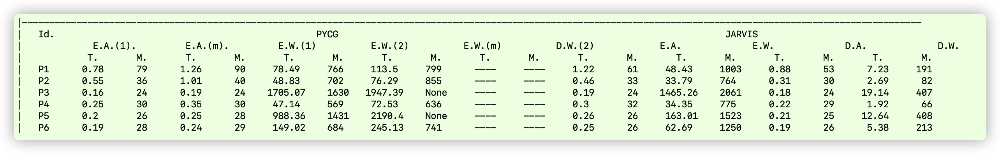
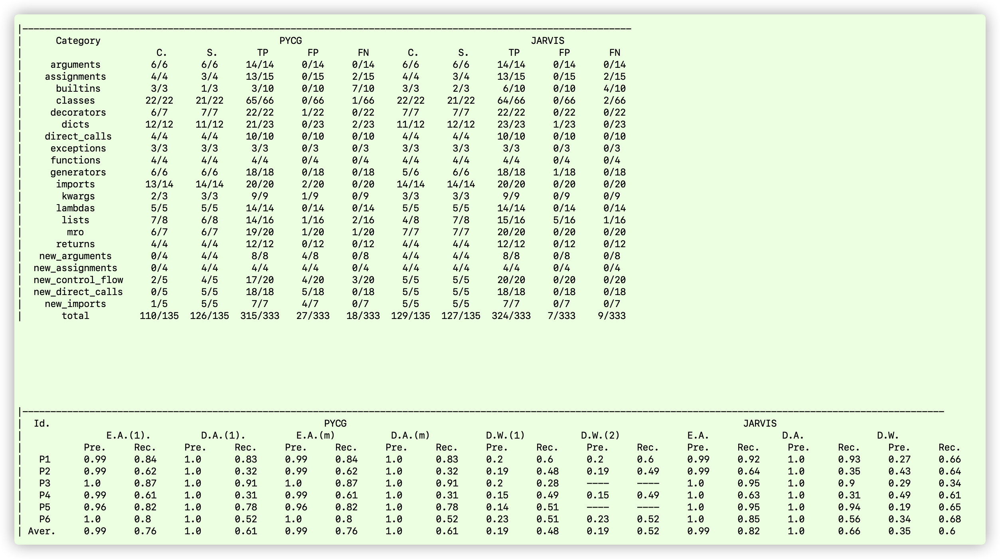

# Jarvis artifact

This is the readme file of Jarvis artifact.


## Dataset and Ground truth

The micro-benchmark and macro-benchmark is provide in `dataset` and `ground_truth` directory.

## Getting Jarvis to run

Prerequisites:
* Python = 3.8
* PyCG: tool/PyCG
* Jarvis: tool/Jarvis

run `jarvis_cli.py`.

Jarvis usage:

```bash
$ python3 tool/Jarvis/jarvis_cli.py [module_path1 module_path2 module_path3...] [--package] [--decy] [-o output_path]
```

Jarvis help:

```bash
$ python3 tool/Jarvis/jarvis_cli.py -h
  usage: jarvis_cli.py [-h] [--package PACKAGE] [--decy] [--precision]
                       [--moduleEntry [MODULEENTRY ...]]
                       [--operation {call-graph,key-error}] [-o OUTPUT]
                       [module ...]

  positional arguments:
    module                modules to be processed, which are also 'Demands' in D.W. mode 

  options:
    -h, --help            show this help message and exit
    --package PACKAGE     Package containing the code to be analyzed
    --decy                whether analyze the dependencies
    --precision           whether flow-sensitive
    --entry-point [MODULEENTRY ...]
                          Entry functions to be processed
    -o OUTPUT, --output OUTPUT
                          Output call graph path
```

*Example 1:* analyze bpytop.py in E.A. mode.

```bash
$ python3 tool/Jarvis/jarvis_cli.py dataset/macro-benchmark/pj/bpytop/bpytop.py --package dataset/macro-benchmark/pj/bpytop -o jarvis.json
```

*Example 2:* analyze bpytop.py in D.W. mode. Note we should prepare all the dependencies in the virtual environment.

```bash
# create virtualenv environment
$ virtualenv venv python=python3.8
# install Dependencies in virtualenv environment
$ python3 -m pip install psutil
# run jarvis
$ python3 tool/Jarvis/jarvis_cli.py dataset/macro-benchmark/pj/bpytop/bpytop.py --package dataset/macro-benchmark/pj/bpytop --decy -o jarvis.jso
```


## Evaluation 

### RQ1 and RQ2 Setup

cd to the root directory of the unzipped files.

```bash
# 1. run micro_benchmark
$ ./reproducing_RQ12_setup/micro_benchmark/test_All.sh
# 2. run macro_benchmark
$ ./reproducing_RQ12_setup/macro_benchmark/pycg_EA.sh
#     PyCG iterates once
$ ./reproducing_RQ12_setup/macro_benchmark/pycg_EW.sh 1
#     PyCG iterates twice
$ ./reproducing_RQ12_setup/macro_benchmark/pycg_EW.sh 2
#     PyCG iterates to convergence 
$ ./reproducing_RQ12_setup/macro_benchmark/pycg_EW.sh
$ ./reproducing_RQ12_setup/macro_benchmark/jarvis_DA.sh
$ ./reproducing_RQ12_setup/macro_benchmark/jarvis_EA.sh
$ ./reproducing_RQ12_setup/macro_benchmark/jarvis_DW.sh
```

### RQ1. Scalability Evaluation


#### Scalability results
Run

```bash
$ python3 ./reproducing_RQ1/gen_table.py
```

The results are shown below:



#### AGs and FAGs 

Run 

```
$ python3 ./reproducing_RQ1/FAG/plot.py
```

The generated graphs are `pycg-ag.pdf`, `pycg-change-ag.pdf` and `jarvis-fag.pdf`, where they represents Fig. 9a, Fig. 9b and Fig 10, correspondingly.


### RQ2. Accuracy Evaluation

#### Accuracy results

Run

```bash
$ python3 ./reproducing_RQ2/gen_table.py     
```

The generated results:




### Case Study: Fine-grained Tracking of Vulnerable Dependencies

#### 1. Target projects

[Fastapi](https://github.com/tiangolo/fastapi),  [Httpie](https://github.com/httpie/httpie), [Scrapy](https://github.com/scrapy/scrapy), [Lightning](github.com/Lightning-AI/lightning), [Airflow](https://github.com/apache/airflow),[sherlock](https://github.com/sherlock-project/sherlock),[wagtail](https://github.com/wagtail/wagtail)

#### 2. Vulnerable libraries in Top 10 dependencies

* ~~**Html**: CVE-2018-17142~~ (Golang)
* **cryptography**: [CVE-2016-9243](https://github.com/pyca/cryptography/commit/b924696b2e8731f39696584d12cceeb3aeb2d874), [CVE-2020-36242](https://github.com/pyca/cryptography/compare/3.3.1...3.3.2), [CVE-2018-10903](https://github.com/pyca/cryptography/pull/4342/commits/688e0f673bfbf43fa898994326c6877f00ab19ef)
* **urllib3**: [CVE-2021-33503](https://github.com/urllib3/urllib3/commit/2d4a3fee6de2fa45eb82169361918f759269b4ec), [CVE-2019-11324](https://github.com/urllib3/urllib3/compare/a6ec68a...1efadf4), [CVE-2019-11236](https://github.com/urllib3/urllib3/issues/1553), [CVE-2020-7212](https://github.com/urllib3/urllib3/commit/a74c9cfbaed9f811e7563cfc3dce894928e0221a)
* **requests**: [CVE-2014-1830](https://bugs.debian.org/cgi-bin/bugreport.cgi?bug=733108), [CVE-2015-2296](https://github.com/kennethreitz/requests/commit/3bd8afbff29e50b38f889b2f688785a669b9aafc), [CVE-2018-18074](https://github.com/psf/requests/commit/c45d7c49ea75133e52ab22a8e9e13173938e36ff)
* ~~**psutil**: CVE-2019-18874~~ (C)
* ~~**Numpy**: CVE-2021-33430, CVE-2014-1858, CVE-2014-1859, CVE-2017-12852~~ (cpp)
* ~~**lxml**: CVE-2021-28957, CVE-2018-19787, CVE-2020-27783, CVE-2014-3146~~ (js)
* **jinja2** : [CVE-2020-28493](https://github.com/pallets/jinja/pull/1343/commits/ef658dc3b6389b091d608e710a810ce8b87995b3), [CVE-2014-0012](https://github.com/mitsuhiko/jinja2/commit/acb672b6a179567632e032f547582f30fa2f4aa7), [CVE-2014-1402](http://advisories.mageia.org/MGASA-2014-0028.html)
* **sqlalchemy** : [CVE-2019-7164](https://github.com/sqlalchemy/sqlalchemy/issues/4481), [CVE-2019-7548](https://github.com/sqlalchemy/sqlalchemy/issues/4481#issuecomment-461204518)
* **httpx**: [CVE-2021-41945](https://github.com/encode/httpx/pull/2214)

The CVEs of html , numpy , lxml,psutil don't relate to  Python , we don't care them.

#### 3. Vulnerable projects using dependency analysis

##### sherlock

```
- sherlock.sherlock
  - requests(v2.28.0)
    - urllib3(v1.26.0) ---- [CVE-2021-33503,CVE-2019-11324,CVE-2019-11236,CVE-2020-7212]
- sherlock.sites
  - requests(v.2.28.0)
    - urllib3(v1.26.0) ---- [CVE-2021-33503,CVE-2019-11324,CVE-2019-11236,CVE-2020-7212]
```

##### airflow

```
- airflow.kubernetes.kube_client
  - urllib3(v1.26.0) ---- [CVE-2021-33503,CVE-2019-11324,CVE-2019-11236,CVE-2020-7212]
- airflow.providers.cncf.kubernetes.operators.pod
  - urllib3(v1.26.0) ---- [CVE-2021-33503,CVE-2019-11324,CVE-2019-11236,CVE-2020-7212]
- airflow.providers.cncf.kubernetes.utils.pod_manager
  - urllib3(v1.26.0) ---- [CVE-2021-33503,CVE-2019-11324,CVE-2019-11236,CVE-2020-7212]
- airflow.executors.kubernetes_executor
  - urllib3(v1.26.0) ---- [CVE-2021-33503,CVE-2019-11324,CVE-2019-11236,CVE-2020-7212]
......
```

##### wagtail

```
- wagtail.contrib.frontend_cache.backends
  - requests(v2.28.0)
    - urllib3(v1.26.0) ---- [CVE-2021-33503,CVE-2019-11324,CVE-2019-11236,CVE-2020-7212]
```

##### Httpie

```
- httpie.client
  - urllib3(v1.26.0) ---- [CVE-2021-33503,CVE-2019-11324,CVE-2019-11236,CVE-2020-7212]
- httpie.ssl_
  - urllib3(v1.26.0) ---- [CVE-2021-33503,CVE-2019-11324,CVE-2019-11236,CVE-2020-7212]
- httpie.models
  - urllib3(1.26.0) ---- [CVE-2021-33503,CVE-2019-11324,CVE-2019-11236,CVE-2020-7212]
```

##### Scrapy

```
- scrapy.downloadermiddlewares.cookies
  - tldextract(v3.4.4)
    - requests(v2.28.0)
      - urllib3(v1.26.0) ---- [CVE-2021-33503,CVE-2019-11324,CVE-2019-11236,CVE-2020-7212]
```

##### Lightning

```
- lightning.app.utilities.network
  - requests(v2.28.0)
    - urllib3(v1.26.0) ---- [CVE-2021-33503,CVE-2019-11324,CVE-2019-11236,CVE-2020-7212]
- lightning.app.utilities.network
  - requests(v2.28.0)
    - urllib3(v1.26.0) ---- [CVE-2021-33503,CVE-2019-11324,CVE-2019-11236,CVE-2020-7212]
- lightning.app.utilities.network
  - requests(v2.28.0)
    - urllib3(v1.26.0) ---- [CVE-2021-33503,CVE-2019-11324,CVE-2019-11236,CVE-2020-7212]
...
```

#### 4. Vulnerable projects using method-level invocation analysis

##### Fastapi

According to the [patch commit](https://github.com/urllib3/urllib3/commit/2d4a3fee6de2fa45eb82169361918f759269b4ec), the vulnerable method of CVE-2021-33503 in urllib3 is `urllib3.util.url`.

Below is the method-level invocation path:

##### Httpie

```
- httpie.apapters.<main>
  - requests.adapters.<main>
    - urllib3.contrib.socks.<main>
      - Urllib3.util.url.<main> ---- CVE-2021-33503
```

##### Scrapy
```
- scrapy.downloadermiddlewares.cookies.<main>
  - tldextract.__init__.<main>
    - tldextract.tldextract.<main>
      - tldextract.suffix_list.<main>
        - requests_file.<main>
          - requests.adapters.<main>
            - Urllib3.util.url.<main> ---- CVE-2021-33503
```
##### Lighting
```
- lightning.app.utilities.network.<main>
  - requests.adapters.<main>
    - urllib3.contrib.socks.<main>
      - Urllib3.util.url.<main> ---- CVE-2021-33503
```
##### Airflow
```
- airflow.providers.amazon.aws.hooks.base_aws.BaseSessionFactory._get_idp_response
  - requests.adapters.<main>
    - urllib3.contrib.sock.<main>
      - urllib3.util.url.<main> ---- CVE-2021-33503
```

**PS:** <main>  represents body code block of python file.(Because python doesn't need entry function)

### Acknowledgements


Our artifact has reused part of the functionalities from third party libraries. i.e., [PyCG](https://github.com/vitsalis/PyCG).

Vitalis Salis et al. PyCG: Practical Call Graph Generation in Python. In 43rd International Conference on Software Engineering (ICSE), 25–28 May 2021.

